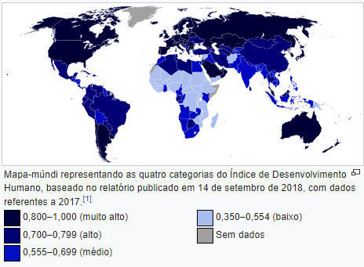
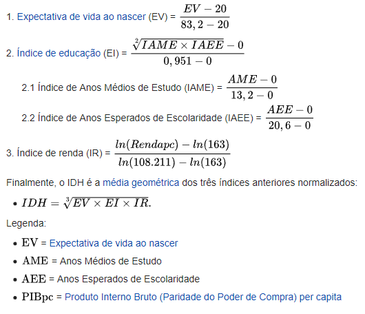
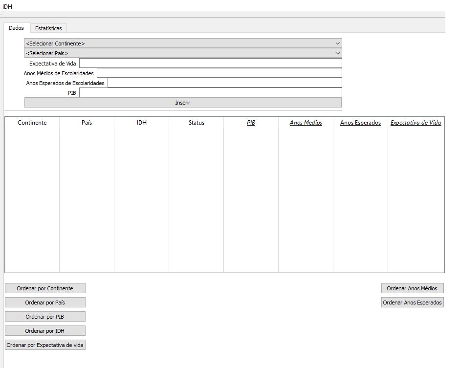
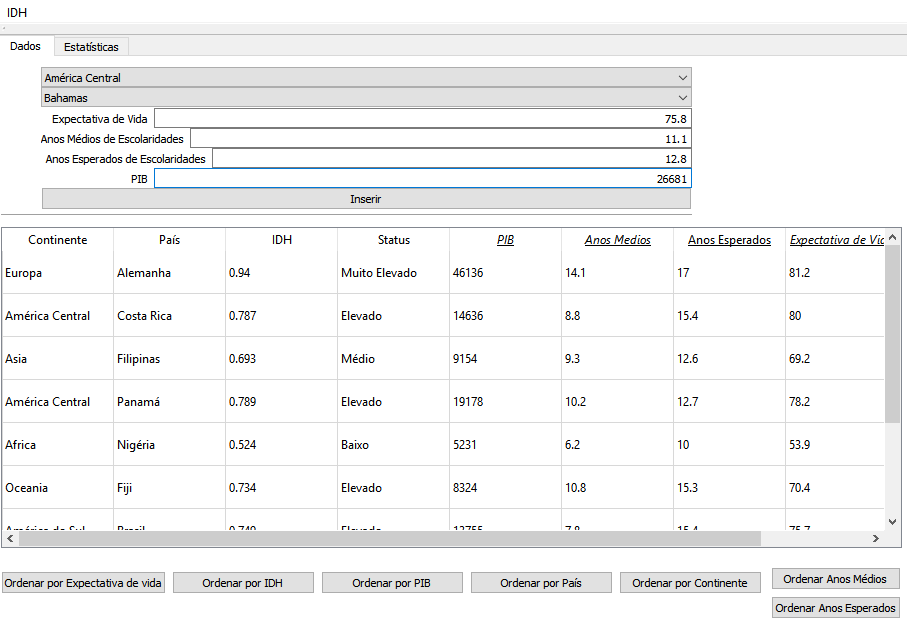
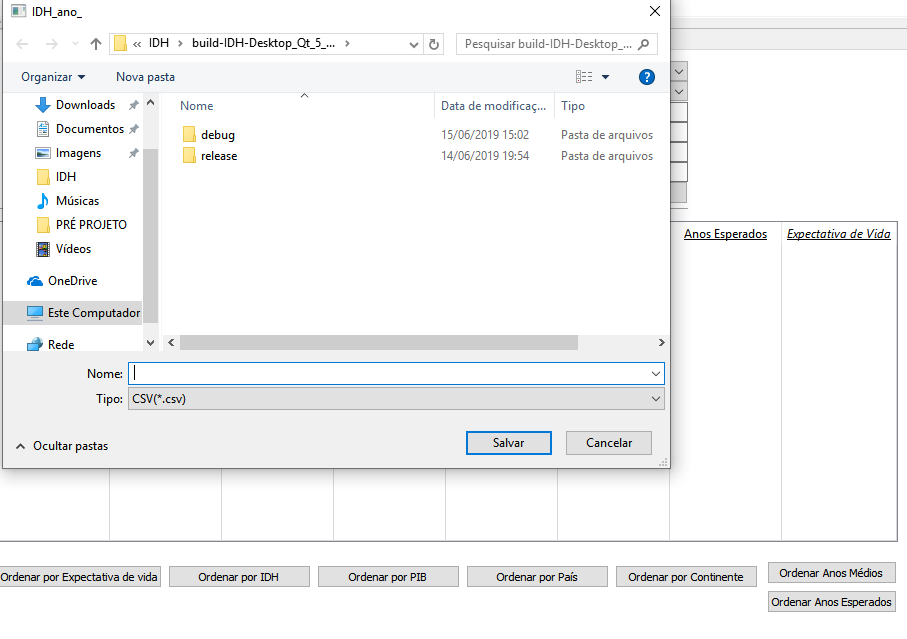
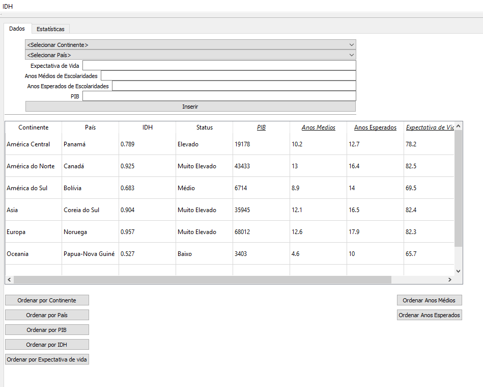
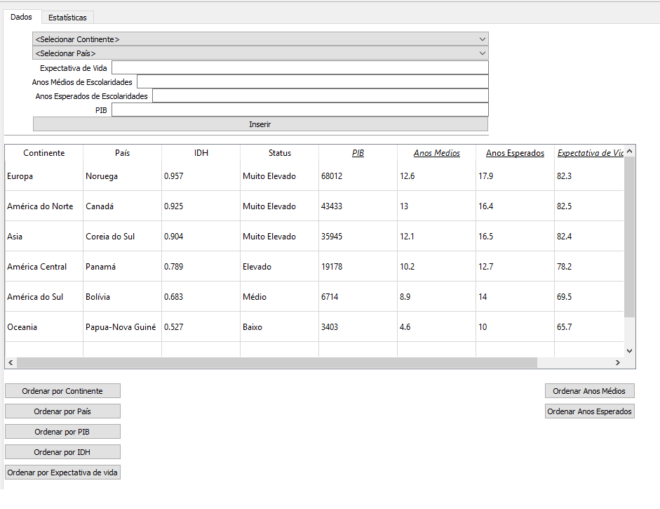

<h1>IDH</h1>
<h2>Índice de Desenvolvimento Humano</h2>
<h3>Código desenvolvido para auxiliar o cálculo IDH.</h3>
<h4>Projeto feito utilizando QT Creator para a disciplina de Técnicas de Programação 2019.1</h4>

O IDH é uma medida comparativa que varia entre 0(nenhum desenvolvimento humano) e 1(desenvolvimento humano total), revelando que quanto maior a proximidade de 1, mais desenvolvido é o pais.

<h2>Critérios de avaliação</h2>

<h3>Metodologia do cálculo</h3>

Para a avaliação do IDH são utilizados três parâmetros(Saúde, Educação e Renda):

Uma vida longa e saudável (*Saúde*): Expectativa de vida ao nascer

O acesso ao conhecimento(*Educação*): Anos Médios de Estudo e Anos Esperados de Escolaridade 

Uma padrão de vida decente(*Renda*): medido pela Renda Naciona Bruta(RNB) com base na Paridade de Poder de Compra(PPC) po habitante

Esse novo método de cálculo do IDH começou a ser adotado no Relatório de Desenvolvimento Humano (RDH) de 2010, pelo Programa das Nações Unidas para o Desenvolvimento (PNUD).

É uma maneira padronizada de avaliação e medida do bem-estar de uma população. É usado para distinguir se o país é desenvolvido, em desenvolvimento ou subdesenvolvido, e para medir igualmente o impacto de políticas econômicas na qualidade de vida.

<h2>Manual do Usuário</h2>

O Programa permite que o usuário cadastre o país, o seu continente, a expectativa de vida ao nascer, o índice de educação atráves de dois critérios(Anos médios de estudos e Anos esperados de escolaridades) e o PIB, baseado nessas informações é gerado um cálculo para o IDH através da seguinte fórmula:

O cadrasto dos valores é feito através da tela Dados do programa.

Exemplo:

Para adicionar os valores existe um critério:

<h4> Expectativa de vida ao nascer (anos): Valor máximo (<b>83.2</b>); Valor mínimo(<b>25</b>). </h4>
<h4> Anos Médios de Estudos(anos): Valor máximo (<b>13.2</b>); Valor mínimo(<b>Valor>1</b>). </h4>
<h4> Anos Esperados de Escolaridades: Valor máximo (<b>20.6</b>); Valor mínimo(<b>Valor<1</b>). </h4>
<h4> PIB PPC (U$D): Valor máximo (<b>108.211</b>); Valor mínimo(<b>164</b>). </h4>
  
 <h3> É possivel salvar e/ ou carregar?? </h3>
     
Sim, é possível. Para realizar essas funções, é necessário selecionar o campo "IDH", em seguida "Salvar" e por fim nomear o arquivo.

     
Já para carregar é só selecionar "carregar" no mesmo campo "IDH", como no exemplo abaixo:

 
 .png)
 
 
   <h3> Função Extra: </h3>
   
  Além das funções já mencionada, existe alguns botões que os dados em ordem alfabética, os países e os continentes, e por do maior para o menor, o PIB, a expecativa de vida, os anos médios e esperados de estudos e o IDH. Veja:
  
 
 

<h3>Obrigado pela compreensão!</h3>

